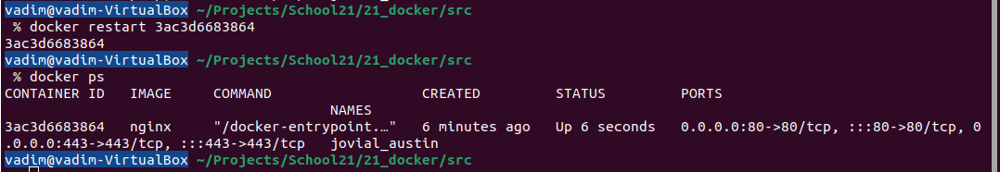

## Part 1. Готовый докер

* **Взять официальный докер образ с nginx и выкачать его при помощи `docker pull`**

  
  

     docker pull command 
  

* **Проверить наличие докер образа через `docker images`**

  
  

     docker images command 
  

* **Запустить докер образ через `docker run -d [image_id|repository]`**

  
  

     docker run command 
  

* **Проверить, что образ запустился через `docker ps`**

  
  

     docker ps command 
  

* **Посмотреть информацию о контейнере через `docker inspect [container_id|container_name]`**

  
  

     docker inspect command 
  

* **По выводу команды определить и поместить в отчёт размер контейнера, список замапленных портов и ip контейнера**

Kоманда `docker inspect` не предоставляет информации о размерах контейнера.
Используя `docker inspect -s nginx`, получаем:

  
  

     docker inspect -s command 
  

  - "SizeRw": 1095 - Размер файлов, которые были созданы или изменены в контейнере
  по сравнению с его исходным образом, в байтах. Это представляет собой разницу
  между состоянием файловой системы контейнера и состоянием файловой системы
  исходного образа контейнера.
  - "SizeRootFs": 186738284 - Общий размер всех файлов в контейнере, в байтах.
  Это включает в себя все файлы, как внутри контейнера, так и файлы из исходного
  образа контейнера.

  - список замапленных портов в данный момент является пустым: `HostConfig.PortBindings: {}`

  
  

     binding port list 
  

* **Остановить докер образ через docker stop [container_id|container_name]**

* **Проверить, что образ остановился через docker ps**

* **Запустить докер с портами 80 и 443 в контейнере, замапленными на такие же порты на локальной машине, через команду run**

* **Проверить, что в браузере по адресу localhost:80 доступна стартовая страница nginx**

* **Перезапустить докер контейнер через docker restart [container_id|container_name]**

* **Проверить любым способом, что контейнер запустился**

## Part 2. Операции с контейнером
