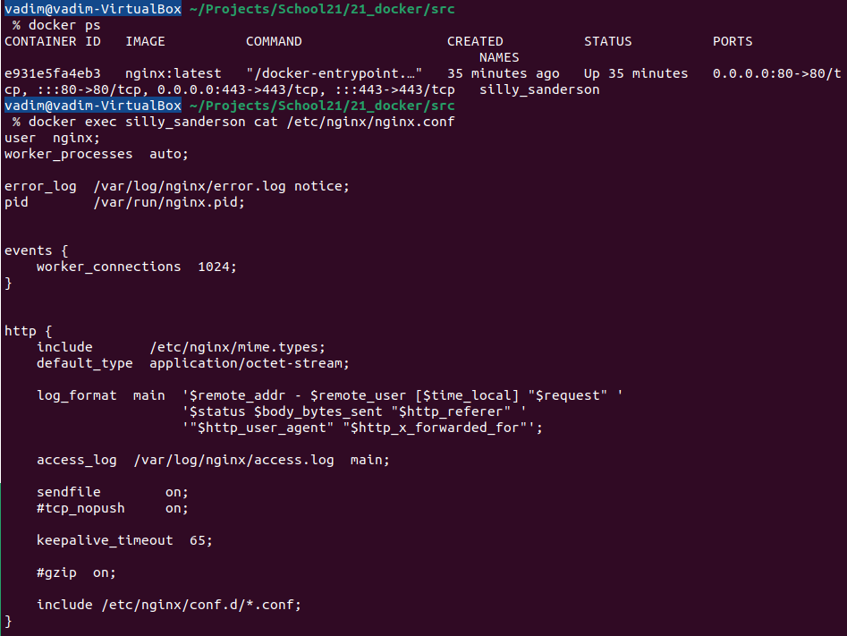
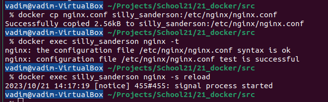
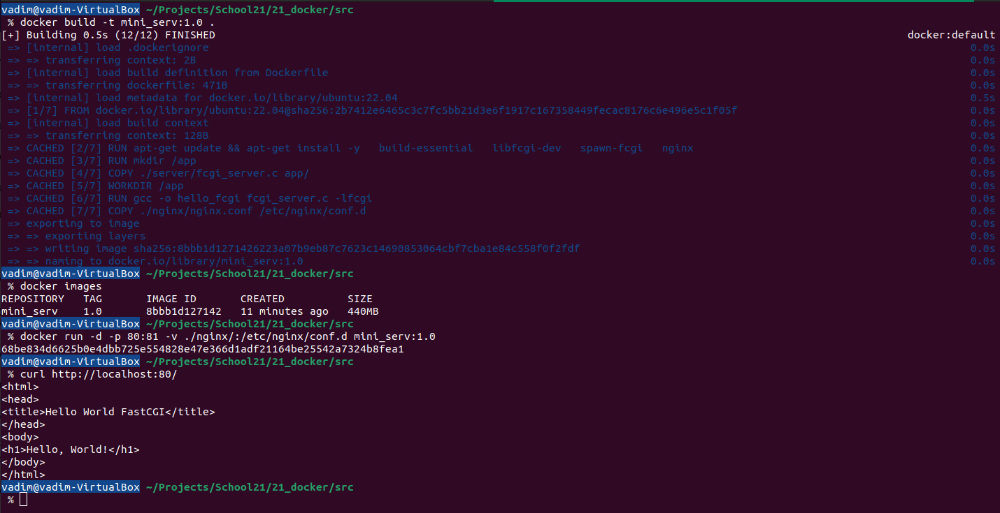

## Part 1. Готовый докер

* **Взять официальный докер образ с nginx и выкачать его при помощи `docker pull`**

  
  

     docker pull command 
  

* **Проверить наличие докер образа через `docker images`**

  
  

     docker images command 
  

* **Запустить докер образ через `docker run -d [image_id|repository]`**

  
  

     docker run command 
  

* **Проверить, что образ запустился через `docker ps`**

  
  

     docker ps command 
  

* **Посмотреть информацию о контейнере через `docker inspect [container_id|container_name]`**

  
  

     docker inspect command 
  

* **По выводу команды определить и поместить в отчёт размер контейнера, список замапленных портов и ip контейнера**

Kоманда `docker inspect` не предоставляет информации о размерах контейнера.
Используя `docker inspect -s nginx`, получаем:

  
  

     docker inspect -s command 
  

`"SizeRw": 1095` - Размер файлов, которые были созданы или изменены в контейнере
  по сравнению с его исходным образом, в байтах. Это представляет собой разницу
  между состоянием файловой системы контейнера и состоянием файловой системы
  исходного образа контейнера.

`"SizeRootFs": 186738284` - Общий размер всех файлов в контейнере, в байтах.
  Это включает в себя все файлы, как внутри контейнера, так и файлы из исходного
  образа контейнера.

Cписок замапленных портов в данный момент является пустым: `HostConfig.PortBindings: {}`

  
  

     binding port list 
  

Ip-адрес контейнера находится в поле `NetworkSettings.IPAddress`:

  
  

     ip-adress 
  

`"IPAddress": "172.17.0.2."`

* **Остановить докер образ через docker stop [container_id|container_name]**

* **Проверить, что образ остановился через docker ps**

  
  

     docker stop + docker ps 
  

* **Запустить докер с портами 80 и 443 в контейнере, замапленными на такие же порты на локальной машине, через команду run**

Для запуска Docker контейнера с портами 80 и 443, замапленными на такие же порты на локальной машине, можно использовать опцию -p: `docker run -p x:y <name>` означает, что порт x контейнера будет замапплен на порт у локальной машины.

  
  

     docker run -p 
  

* **Проверить, что в браузере по адресу localhost:80 доступна стартовая страница nginx**

  
  

     localhost:80 nginx 
  

* **Перезапустить докер контейнер через docker restart [container_id|container_name]**

* **Проверить любым способом, что контейнер запустился**

  
  

     docker restart 
  

## Part 2. Операции с контейнером

* **Прочитать конфигурационный файл nginx.conf внутри докер контейнера через команду exec**

  
  

     docker exec 
  

* **Создать на локальной машине файл nginx.conf**

* **Настроить в нем по пути /status отдачу страницы статуса сервера nginx**

  
  

     nginx.conf settings 
  

Этот конфигурационный блок настраивает сервер Nginx на прослушивание порта 80 и
обработку пути /status. Директива `stub_status` позволяет отдавать страницу статуса
сервера Nginx. 

* **Скопировать созданный файл nginx.conf внутрь докер образа через команду docker cp** 

* **Перезапустить nginx внутри докер образа через команду exec**

  
  

     copying and testing 
  

* **Проверить, что по адресу localhost:80/status отдается страничка со статусом сервера nginx**

Проверил по адресу `127.0.0.1:80/status`, так как при попытке задать `server_name localhost`
происходил конфликт имен.

  
  

     127.0.0.1/status 
  

* **Экспортировать контейнер в файл container.tar через команду export**

  
  

     docker export 
  

* **Остановить контейнер**

  
  

     docker export 
  

* **Удалить образ через docker rmi [image_id|repository], не удаляя перед этим контейнеры**

  
  

     docker rmi -f 
  

* **Удалить остановленный контейнер**

  
  

     docker rmi -f 
  

* **Импортировать контейнер обратно через команду import**

* **Запустить импортированный контейнер**

  
  

     docker import + run 
  

## Part 3. Мини веб-сервер

* **Написать мини сервер на C и FastCgi, который будет возвращать простейшую
страничку с надписью Hello World!** 

`sudo apt install libfcgi-dev` - разработочный пакет для библиотеки FastCGI,
он включает заголовочные файлы и другие ресурсы, необходимые для разработки
FastCGI-приложений

  
  

     mini C server 
  

`gcc -o hello_fcgi hello_fcgi.c -lfcgi` - компиляция

* **Запустить написанный мини сервер через spawn-fcgi на порту 8080**

  
  

     bash script for server run 
  

_Здесь -a указывает IP-адрес, -p указывает порт, и -n указывает путь к
скомпилированному серверу hello_fcgi_

* **Написать свой nginx.conf, который будет проксировать все запросы с 81 порта на 127.0.0.1:8080**

  
  

     nginx.conf 
  

* **Проверить, что в браузере по localhost:81 отдается написанная вами страничка**

  
  

     Hello World! 
  

* **Положить файл nginx.conf по пути ./nginx/nginx.conf (это понадобится позже)**

  
  

     move nginx.conf file 
  

## Part 4. Свой докер

* **Написать свой докер образ, который:**

  - собирает исходники мини сервера на FastCgi из Части 3
  - запускает его на 8080 порту
  - копирует внутрь образа написанный ./nginx/nginx.conf
  - запускает nginx. 

  
  

     Dockerfile 
  

* **Собрать написанный докер образ через docker build при этом указав имя и тег**

* **Проверить через docker images, что все собралось корректно**

* **Запустить собранный докер образ с маппингом 81 порта на 80 на локальной машине
и маппингом папки ./nginx внутрь контейнера по адресу, где лежат конфигурационные файлы nginx'а**

* **Проверить, что по localhost:80 доступна страничка написанного мини сервера**

  
  

     docker build + images + run with mapping 
  

* **Дописать в ./nginx/nginx.conf проксирование странички /status, по которой надо отдавать статус сервера nginx**

* **Перезапустить докер образ**

> Если всё сделано верно, то, после сохранения файла и перезапуска контейнера, конфигурационный файл внутри докер образа должен обновиться самостоятельно без лишних действий

* **Проверить, что теперь по localhost:80/status отдается страничка со статусом nginx**

  
  

     adding status using mapping 
  

